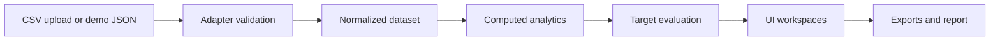

# Campaign Pulse

Campaign Pulse is a local-first marketing intelligence command center that turns newsletter delivery, engagement, revenue, audience, and campaign facts into a decision-ready monthly view. It is an advanced frontend data-product prototype built to demonstrate ingestion contracts, target-aware analytics, segment movement intelligence, browser-only exports, and editorial reporting without requiring a backend.

[Live demo](https://campaign-pulse.vercel.app/) · [Portfolio case study](docs/portfolio-case-study.md) · [Public release checklist](docs/public-release-checklist.md)

> Campaign Pulse is a portfolio prototype, not a production SaaS product. It uses synthetic demo data and browser-local state only.

## Screenshots

Final screenshots are not committed yet. Capture these states before publishing the portfolio entry:

1. Overview mission-control
2. Data import readiness and local CSV upload
3. Editable column mapping
4. Audience — all segments
5. Audience — selected segment detail
6. Calendar — month view
7. Newsletters ranking table
8. Campaign comparison
9. Report memo
10. Export actions

See the detailed capture notes in [docs/public-release-checklist.md](docs/public-release-checklist.md).

## Feature overview

- Monthly mission-control view with KPI hierarchy, target status, risks, anomalies, and recommended next moves.
- Calendar, newsletter, campaign, audience, insights, report, and data workspaces.
- Newsletter ranking, campaign comparison, audience value/pressure analysis, saturation diagnostics, and segment movement labels.
- Editable global, campaign, and segment targets with deterministic `On track`, `Watch`, and `Off track` evaluation.
- Demo JSON and local CSV sources normalized through the same adapter contract.
- Editable CSV column mapping, alias inference, required-field checks, accepted/rejected row diagnostics, and guarded session activation.
- Browser-only JSON and CSV export pack plus dependency-free report printing.
- GitHub Actions quality gate and Git-connected Vercel deployment configuration.

## Architecture

Campaign Pulse keeps ingestion, normalized facts, analytics, and presentation separate while remaining entirely client-side.



The app uses:

- `data/newsletter-performance.json` for newsletter, campaign, and segment facts.
- `data/audience-members.json` for synthetic `.test` audience examples.
- `data/targets.json` for default target settings.
- `lib/adapters/` for source validation, mapping, diagnostics, and normalization.
- TypeScript utilities for rates, saturation, fatigue, movement, insights, recommendations, and report values.
- Browser state for uploaded CSV sessions and `localStorage` for target edits.

No rates, rankings, saturation labels, fatigue diagnoses, insights, or recommendations are precomputed in the source JSON.

## Data flow and adapter framework

Both implemented sources produce the same normalized dataset:

```text
source rows
  -> column mapping
  -> validation and rejected-row diagnostics
  -> adapter normalization
  -> campaigns, segments, newsletters, segment performance, targets
  -> computed analytics and target evaluation
  -> dashboard workspaces and exports
```

Implemented adapters:

- `demoJsonAdapter`: validates and normalizes the bundled demo JSON, synthetic audience members, and default targets.
- `csvExportAdapter`: validates flat one-newsletter × one-segment rows and merges them into the normalized model.

Klaviyo, Mailchimp, HubSpot, and Customer.io are documented mapping targets only; there are no live vendor integrations. See [docs/data-adapter-contract.md](docs/data-adapter-contract.md) and [docs/source-mapping-examples.md](docs/source-mapping-examples.md).

## Local CSV upload workflow

The Data workspace reads `.csv` files with browser `FileReader`. Nothing is uploaded to a server.

1. Select a local CSV file.
2. Review parsed rows and detected columns.
3. Accept inferred aliases or edit column mappings.
4. Review missing/duplicate mappings and rejected-row diagnostics.
5. Activate valid normalized data for the current browser session.
6. Return to bundled Demo JSON at any time.

Uploaded files, mappings for that upload, and normalized uploaded datasets are session-only. Refreshing the page restores Demo JSON.

Recommended canonical headers:

```text
sendDate,newsletterId,newsletterName,campaignId,campaignName,
segmentId,segmentName,sent,delivered,opens,clicks,orders,revenue,
unsubscribes,spamComplaints,subject,creativeAngle
```

## Target system

Targets exist at global, campaign, and segment scope. Campaign and segment targets inherit global defaults unless overridden. Supported targets include revenue, OR, CTR, CTOR, conversion rate, RPR, maximum unsubscribe rate, maximum spam rate, maximum weekly sends, and maximum pressure score.

Target edits persist in the current browser profile under `localStorage`. They are not written to the demo files, shared between browsers, or stored remotely.

## Export pack and report

All exports are generated in the browser:

- Data: normalized dataset, target settings, adapter validation, and import diagnostics as JSON.
- Newsletters: current-month ranking as UTF-8 CSV.
- Audience: current-month segment value, movement, pressure, and target status as UTF-8 CSV.
- Campaigns: current-month campaign performance and target status as UTF-8 CSV.
- Report: monthly memo data as JSON and browser print.

For clean print/PDF capture, disable browser print headers and footers manually. Campaign Pulse does not include a PDF library or server-side renderer.

## Tech stack

- Next.js 14 App Router
- React 18
- TypeScript
- Tailwind CSS
- Recharts
- Node test runner with `tsx`
- ESLint
- Static JSON and browser-local state
- GitHub Actions
- Vercel

## Local setup

Requirements: Node.js 20 and npm.

```bash
git clone git@github.com:RaulMermans/campaign-pulse.git
cd campaign-pulse
npm ci
npm run dev
```

Open [http://localhost:3000](http://localhost:3000).

`package-lock.json` is the retained lockfile and npm is the project package manager. Do not add pnpm lock or workspace files unless the repository is deliberately migrated.

## Package scripts

| Command | Purpose |
| --- | --- |
| `npm run dev` | Start the local Next.js development server. |
| `npm run test` | Run focused analytics, adapter, upload, target, and export tests. |
| `npm run lint` | Run the Next.js ESLint checks. |
| `npm run typecheck` | Run TypeScript without emitting files. |
| `npm run build` | Create a production Next.js build. |
| `npm run start` | Serve the production build locally. |
| `npm run verify` | Run test, lint, typecheck, and build in sequence. |

Full release verification:

```bash
npm ci
npm run test
npm run lint
npm run typecheck
npm run build
npm run verify
git diff --check
```

## Vercel deployment

The public demo is deployed at [campaign-pulse.vercel.app](https://campaign-pulse.vercel.app/).

Recommended Vercel project settings:

| Setting | Value |
| --- | --- |
| Framework preset | Next.js |
| Install command | `npm ci` |
| Build command | `npm run build` |
| Output directory | Vercel default |
| Production branch | `main` |
| Environment variables | None required |

Use Git integration for pull-request previews and production deployments from `main`. Confirm GitHub Actions passes before promoting a deployment.

## Demo data and security boundary

All bundled records are synthetic. Masked audience identities use `.test` domains, and placeholder links use `example.com`. Do not replace them with customer data.

This repository has:

- no backend
- no database
- no authentication or authorization
- no server-side uploads or persistent import jobs
- no CRM/ESP API integration
- no OAuth or API secrets
- no AI/LLM calls
- no required environment variables

See [SECURITY.md](SECURITY.md) for the public-demo security scope.

## Known limitations

- This is a demo/local-first app, not a production SaaS service.
- Uploaded CSV data exists only for the current browser session.
- Target edits persist only in browser `localStorage`.
- There is no real CRM/ESP API or scheduled synchronization.
- There is no backend, database, auth, multi-user state, or server-side audit trail.
- Browser print headers and footers must be disabled manually for clean output.
- Current npm audit advisories should be handled in a dedicated future Next.js upgrade branch, with regression testing; do not use forced audit upgrades as release cleanup.
- Analytics and recommendations are deterministic prototype logic and should be validated against production business definitions before operational use.

## Future production roadmap

- Authenticated workspaces, tenant isolation, and role-based access.
- Durable encrypted storage, import history, and server-side audit logs.
- Vendor-specific CRM/ESP adapters with OAuth, pagination, retries, and scheduled sync.
- Production-grade metric definitions and attribution configuration.
- Dataset versioning, reconciliation, observability, and recovery workflows.
- Accessibility, browser, performance, and security testing at production scope.
- Controlled Next.js dependency upgrade and audit remediation.

These are productionization directions, not committed prototype features.

## Recent sprint chronology

- **Sprint 18:** GitHub Actions CI and Vercel deployment preparation.
- **Sprint 19:** Adapter contract and Demo JSON adapter.
- **Sprint 20:** CSV export adapter and CRM/ESP mapping documentation.
- **Sprint 21:** Static column-mapping preview and rejected-row diagnostics.
- **Sprint 22:** Editable column mapping with alias inference and local persistence.
- **Sprint 23:** Client-side CSV upload and session-only dataset activation.
- **Sprint 24:** Browser export pack, print polish, and portfolio capture preparation.
- **Sprint 25:** Public repository, portfolio case study, release checklist, and final packaging polish.

The full history is documented in [docs/sprint-plan.md](docs/sprint-plan.md).

## Project workflow reference

The project documentation references the curated vibe-coding workflow collection at [awesome-vibe-coding](https://github.com/filipecalegario/awesome-vibe-coding).
