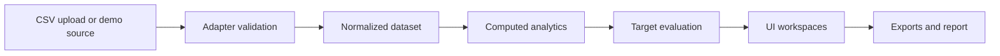

# Campaign Pulse — Portfolio Case Study

## Project title

**Campaign Pulse: a local-first marketing intelligence tool and advanced frontend data-product prototype**

Campaign Pulse turns newsletter campaign facts into a decision-ready view of revenue, engagement, audience pressure, segment movement, target performance, and recommended next actions.

## Problem

Newsletter operators can usually retrieve delivery, open, click, conversion, and revenue metrics, but those facts are fragmented across ESP reports and spreadsheets. The harder work is interpretation: identifying which campaign carried the month, where audience fatigue is building, which segment is gaining or losing value, and what should change next.

## Product idea

The product acts as an editorial marketing strategy room rather than a generic dashboard. It combines a monthly mission-control view with focused calendar, newsletter, campaign, audience, insights, report, and data workspaces. The prototype remains local-first so the data model, intelligence layer, and interaction design can be evaluated without backend complexity.

This is intentionally positioned as an advanced frontend data-product prototype, not a full production SaaS platform.

## What I built

- A multi-workspace Next.js command center for monthly newsletter analysis.
- Newsletter, campaign, audience, saturation, and target-aware performance views.
- Deterministic insights, anomaly callouts, recommendations, and segment movement labels.
- A source-independent adapter boundary for bundled JSON and flat CSV exports.
- Browser-local CSV parsing, editable column mapping, and rejected-row diagnostics.
- Editable global, campaign, and segment targets stored in browser `localStorage`.
- Client-side JSON/CSV export actions and a print-ready monthly report.
- Focused automated tests, GitHub Actions CI, and Git-connected Vercel deployment preparation.

## Architecture

The architecture separates ingestion from analytics and presentation:



Raw source facts remain free of derived rates, rankings, diagnoses, and recommendations. TypeScript utilities calculate those values after normalization.

## Data ingestion framework

`demoJsonAdapter` validates the bundled newsletter, audience, and target files. `csvExportAdapter` accepts flat rows at one newsletter × one segment grain, validates them, merges repeated entities, and emits the same normalized dataset shape.

The CSV workflow adds a dependency-free parser, exact and inferred field mapping, manual mapping overrides, required-field checks, row-level rejection reasons, and guarded session activation. Uploaded data stays in browser memory and is never sent to a server.

Klaviyo, Mailchimp, HubSpot, and Customer.io are documented as future adapter targets only. Mapping guidance is available in [source-mapping-examples.md](source-mapping-examples.md).

## Analytics/intelligence layer

The intelligence layer derives:

- OR, CTR, CTOR, conversion rate, revenue per recipient, unsubscribe rate, and spam rate.
- Monthly, campaign, newsletter, and segment summaries.
- Audience pressure, saturation, and fatigue signals.
- Segment movement states: Growing, Stable, Declining, Fatigued, and Recovering.
- Global, campaign, and segment target evaluation.
- Opportunity/risk rankings, anomaly callouts, and evidence-backed recommendations.
- Monthly report content and export rows.

All calculations are deterministic and based on normalized local facts. No AI service is involved.

## UX decisions

- **Mission control first:** the Overview prioritizes business health, target status, audience pressure, and the next best move.
- **Calendar as cadence evidence:** month, week, and day views reveal send concentration and pressure over time.
- **Shared detail model:** calendar cards and ranking rows open the same newsletter detail drawer.
- **Audience master-detail:** every segment remains visible while a selected segment opens deeper trend, campaign-fit, and history views.
- **Diagnostics before activation:** CSV users see mapping and rejected-row issues before replacing the demo dataset for the session.
- **Editorial visual language:** soft neutral surfaces, strong typography, restrained color, subtle borders, and decision-led card hierarchy support portfolio presentation.

## Testing/CI/deployment

The repository includes focused tests for analytics, targets, adapters, CSV parsing/mapping, upload guards, and exports. GitHub Actions runs on pull requests and pushes to `main` using Node 20:

```text
npm ci -> test -> lint -> typecheck -> build
```

CI also rejects committed dependency/build output and pnpm metadata. The public demo uses Git-connected Vercel deployment with no required environment variables.

## Screenshots to capture

1. Overview mission-control
2. Data import readiness and local CSV upload
3. Editable column mapping
4. Audience all-segments view
5. Audience selected-segment detail
6. Calendar month view
7. Newsletters ranking table
8. Campaign comparison
9. Report memo
10. Export actions

## What I would add in production

- Authentication, tenant isolation, roles, and audit history.
- Encrypted durable storage and dataset versioning.
- Vendor-specific OAuth adapters, scheduled sync, retries, and reconciliation.
- Configurable attribution and production-owned metric definitions.
- Observability, import recovery, privacy controls, and data-retention policy.
- Accessibility, performance, browser, security, and load testing.
- A controlled Next.js upgrade branch to resolve current dependency advisories.

## Final positioning

Campaign Pulse demonstrates how a local-first frontend can model a credible data ingestion boundary, normalize multiple source shapes, compute marketing intelligence, and present decisions rather than raw metrics. It is best described as a **local-first marketing intelligence tool / advanced frontend data-product prototype**.

The implementation workflow was informed by the resources collected in [awesome-vibe-coding](https://github.com/filipecalegario/awesome-vibe-coding).
